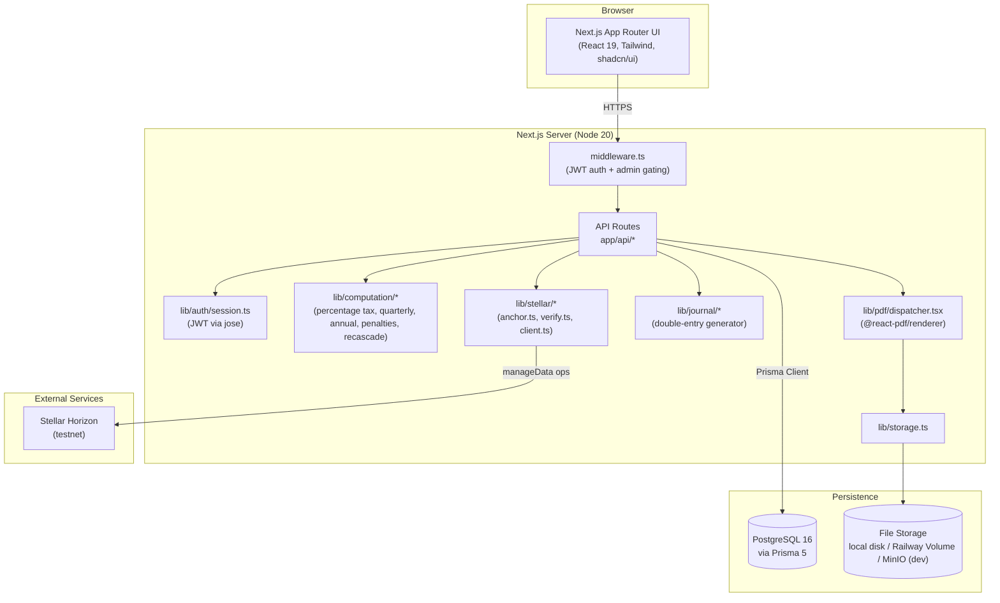
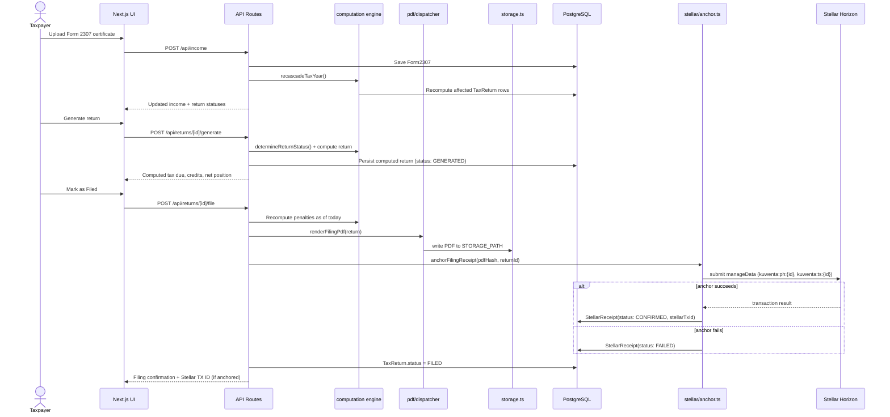
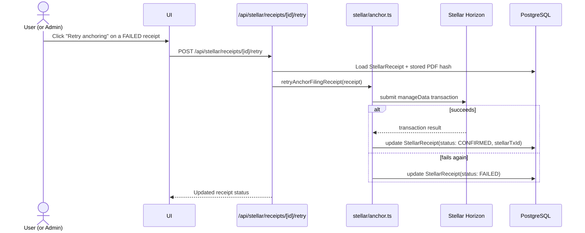

# Krunchr

> Compliance Engine — Philippine tax filing, automated and anchored on-chain.

Krunchr is a web-based tax compliance system for Filipino self-employed professionals and freelancers on the BIR's 8% flat income-tax rate. The hero flow: a user uploads their BIR Form 2307 withholding certificates, Krunchr computes their full tax position and generates all legally-mandated returns in sequence, and every filed return is hashed, PDF-packaged, and anchored as a tamper-proof receipt on the Stellar blockchain.

## Status

| | |
|---|---|
| **Version** | `0.1.0` (from `package.json`; no git tags/releases published) [inferred: pre-release/hackathon build] |
| **Branch** | `develop` (default), CI runs on `develop` and `main` |
| **License** | Not specified — no `LICENSE` file in the repo |
| **Track** | APAC Stellar Hackathon 2026 — Local Finance & Real World Access (per `README.md`/`SPEC.md`) |

## Problem

Filipino self-employed professionals and freelancers electing the 8% flat income-tax rate must file up to **8 sequential BIR returns per year** (2551Q ×4, 1701Q ×3, 1701A), each with strict prerequisite ordering, statutory deadlines, and legally-specific computation rules — e.g. mixed-income earners get no ₱250,000 exemption and must use Form 1701 instead of 1701A; the 8% election is irrevocable once made; RA 11976 changed penalty rates (10% surcharge / 6% interest, not the old 25%/12%); the ₱500 registration fee was abolished in favor of a ₱30 DST. Manual filing is error-prone against this many interacting rules, and once filed, there is no simple, verifiable way for a third party (a bank, an embassy, an auditor) to confirm a return was genuinely filed and unaltered. (Grounded in `SPEC.md` Overview and Business Rules.)

## Vision / Purpose

Built for the **APAC Stellar Hackathon 2026 — Local Finance & Real World Access** track, Krunchr's stated goal (per `SPEC.md`) is a single demo moment: a freelancer uploads their 2307 certificates, the system computes their full tax position, generates all sequenced returns, and each filed return is permanently anchored on Stellar — producing a compliance trail that banks and embassies can verify in seconds. Longer-term, the project targets full BIR filing-sequence automation for 8%-electee taxpayers, with graduated-rate support, VAT-threshold enforcement, and admin tooling called out in `SPEC.md`/`CLAUDE.md` as remaining work. [inferred: hackathon-originated project maturing toward a real compliance product]

## Target Users

- **Self-employed freelancers on the 8% flat rate** — need a guided, correct-by-construction path through 8 mandatory returns without hiring an accountant for every quarter.
- **Mixed-income earners (salary + freelance)** — need computations that correctly skip the ₱250,000 exemption and route to Form 1701 instead of 1701A.
- **Banks / embassies / third-party verifiers** — need a fast, tamper-evident way to confirm a filing actually happened, via the Stellar-anchored hash rather than trusting a scanned PDF.
- **BIR-compliance admins** *(role: `ADMIN`)* — need to manage ATC codes, RDO penalty schedules, holiday calendars, and audit logs across taxpayers.

## Features

**Onboarding & Eligibility**
- Taxpayer registration (TIN, RDO code, income type, COR-2551Q flag, new-registrant flag) — `app/onboarding` / `/api/taxpayer`
- 5-point eligibility validation (individual taxpayer, self-employment income, non-VAT, gross receipts < ₱3,000,000, no prior graduated-rate Q1 filing) — `/api/taxpayer/eligibility`
- ATC code setup with a lookup table and admin-configurable EWT rates — `/api/atc`

**Income Management**
- Form 2307 (withholding certificate) CRUD, grouped by quarter and payor, with CWT-vs-ATC-rate validation — `/api/income`, `/api/income/[id]`
- YTD income/CWT summaries and VAT-threshold tracking, with PDF/Excel export — `/api/income/summary`, `/api/income/summary/export`
- Every 2307 mutation triggers a recascade of all downstream return computations — `lib/computation/recascade.ts`, `/api/computation/recascade`

**Tax Rate Election**
- Supports all three legal election paths — Item 13 (2551Q Q1), Item 16 (1701Q Q1), or Form 1905 — with the actual BIR line item resolved and stored separately from the recording method — `/api/election`, `lib/election-rules.ts`
- Mandatory four-point disclosure confirmation before locking the election, logged to the audit trail — `/api/election/history`

**Filing Sequence & Computation**
- Enforces the legally-mandated return order (8-return or 4-return path depending on COR) with `BLOCKED → PENDING → GENERATED → FILED` status gating — `lib/computation/sequence.ts`, `/api/returns/sequence`
- Pure, typed computation engines for percentage tax (2551Q), cumulative quarterly income tax (1701Q), and annual income tax (1701A/1701) — `lib/computation/`
- Dry-run computation preview without persisting — `/api/computation/preview`
- Penalty computation and forecasting under RA 11976 reduced rates (10% surcharge, 6% interest) — `/api/penalties/[returnId]`, `/api/penalties/simulate`
- Prior-year credit and overpayment disposition (carry-over / refund / tax credit certificate) — `/api/prior-year-credit/[id]`, `/api/overpayment/[taxYear]`

**Filing & Documents**
- Server-side BIR-form PDF generation via `@react-pdf/renderer`, dispatched per form type — `lib/pdf/dispatcher.tsx`
- Full filing-package ZIP download (all returns + cover sheet + income summary) — `/api/filing-package/download`
- Auto-generated double-entry journal entries (subsections 9A–9G) on filing events, with chart-of-accounts lookup and CSV export — `lib/journal/`, `/api/journal/*`

**Stellar Blockchain Anchoring**
- On filing, the return PDF is SHA-256 hashed and anchored via two Stellar `manageData` operations (hash + ISO timestamp) — `lib/stellar/anchor.ts`
- Anchoring failure does not block filing; a `StellarReceipt` is created/updated with status `FAILED` and can be retried — `/api/stellar/receipts/[id]/retry`
- On-chain verification re-fetches the Horizon `manageData` entries and compares the hash against the stored PDF — `lib/stellar/verify.ts`, `/api/stellar/verify`
- Horizon health/account-sequence probe — `/api/stellar/status`

**Auth & Admin**
- Username/password login, JWT (HS256) issued via `jose`, stored as an httpOnly/secure/`SameSite=Strict` cookie, 8-hour expiry — `lib/auth/session.ts`, `/api/auth/login`
- Route protection and admin gating in `middleware.ts` (`/admin/*` and `/api/admin/*` require `role === 'ADMIN'`)
- Admin panels for user management, ATC codes, RDO penalty schedule, public holiday calendar, audit log, and system health — `/api/admin/*`
- Append-only audit log for every state-changing action (election, filing, overpayment disposition, Stellar retry) — `AuditLog` model, `/api/admin/audit-log`

## Architecture



## Sequence Diagrams

### Hero flow: upload 2307 → generate → file → anchor on Stellar



### Auth flow

```mermaid
sequenceDiagram
    actor U as User
    participant UI as Login Page
    participant API as /api/auth/login
    participant AUTH as lib/auth/session.ts
    participant DB as PostgreSQL
    participant MW as middleware.ts

    U->>UI: Submit username/password
    UI->>API: POST /api/auth/login
    API->>DB: Look up User, verify bcrypt hash
    API->>AUTH: signToken({sub, username, role}) [HS256, 8h expiry]
    AUTH-->>API: JWT
    API->>UI: Set-Cookie: kuwenta_session (httpOnly, secure, SameSite=Strict)
    UI->>MW: Subsequent request to protected route
    MW->>AUTH: verifyToken(cookie)
    alt valid + role check passes
        MW-->>UI: Request proceeds
    else invalid / missing / wrong role
        MW-->>UI: 401 (API) or redirect to /login (page); 403 for non-admin on /admin/*
    end
```

### Stellar anchor retry flow (async/failure-recovery)



## Smart Contracts

No Soroban/Rust contract crates were found in this repository (no `Cargo.toml`, no `contracts/` directory). All Stellar interaction is off-chain SDK usage (`@stellar/stellar-sdk`) submitting `manageData` operations directly — there is currently no on-chain contract layer.

<!-- PLACEHOLDER: Soroban smart contracts — document each contract's purpose, public functions, parameters, and deployment/upload process here. -->

## Tech Stack

**Frontend**
- Next.js 15.5.19 (App Router), React 19.1.0, TypeScript 5
- Tailwind CSS 4.3.1, shadcn 4.12.0, `class-variance-authority` 0.7.1, `lucide-react` 1.21.0

**Backend / API**
- Next.js API routes (Node.js 20+, per `SPEC.md`/CI)
- Prisma 5 ORM over PostgreSQL
- `jose` 5 (JWT signing/verification), `bcrypt` 5 (password hashing)
- `decimal.js` 10 (monetary arithmetic — never native JS numbers per `CLAUDE.md`), `zod` 3 (validation)

**Blockchain**
- `@stellar/stellar-sdk` ^12 — Horizon client, `manageData` anchoring, keypair management (testnet, per `.env.example`)

**Documents**
- `@react-pdf/renderer` 4.5.1 (server-side PDF generation)
- `exceljs` 4.4.0, `xlsx` 0.18.5 (spreadsheet export), `jszip` 3.10.1 (filing-package ZIP), `react-qr-code` 2.2.0

**Infra / Storage**
- PostgreSQL 16 (Docker: `postgres:16-alpine`; production: Railway Postgres)
- File storage: local disk / Railway Volumes in production, MinIO (`minio/minio:latest`) for local S3-compatible dev storage

**CI / Tooling**
- pnpm package manager
- ESLint 9, Vitest 3 (`test`, `test:unit`, `test:run`, `test:ui` scripts)
- GitHub Actions (`.github/workflows/ci.yml`): lint → test (with a PostgreSQL service container) → build, on push/PR to `develop`/`main`
- GitHub Actions (`.github/workflows/deploy.yml`): triggers a Railway deploy hook on push to `main` (skips gracefully if the hook secret is unset)

## How to Run Locally

**Prerequisites:** Node.js 20+, pnpm, Docker (for local Postgres + MinIO).

1. **Install dependencies**
   ```bash
   pnpm install
   ```

2. **Configure environment**
   ```bash
   cp .env.example .env.local
   ```
   Fill in the following. Variables marked *required* are needed for the app to start/function correctly; *optional* ones have documented fallback behavior.

   | Variable | Required? | Notes |
   |---|---|---|
   | `JWT_SECRET` | Required | HS256 signing key for session JWTs |
   | `ADMIN_PASSWORD` | Required | Bootstraps the seeded admin account |
   | `DATABASE_URL` | Required | PostgreSQL connection string |
   | `NODE_ENV` | Required | `development` / `test` / `production` |
   | `NEXTAUTH_SECRET`, `NEXTAUTH_URL` | Optional [inferred] | Present in `.env.example` but auth is JWT/cookie-based via `lib/auth/session.ts`, not NextAuth |
   | `STORAGE_TYPE` | Optional | `local` (default) or `railway` |
   | `STORAGE_PATH` | Optional | Defaults to `/app/storage`; override to `./storage` on Windows if unwritable |
   | `MINIO_ENDPOINT`/`MINIO_PORT`/`MINIO_ACCESS_KEY`/`MINIO_SECRET_KEY`/`MINIO_BUCKET` | Optional | Only used with local MinIO dev storage |
   | `STELLAR_SECRET_KEY` | Required for anchoring | Without it, filing still succeeds but Stellar anchoring fails and a `FAILED` `StellarReceipt` is created (retryable) |
   | `STELLAR_NETWORK`, `STELLAR_HORIZON_URL` | Optional | Default to Stellar testnet |
   | `RAILWAY_VOLUME_MOUNT_PATH` | Optional | Only relevant when `STORAGE_TYPE=railway` in production |

3. **Start local services**
   ```bash
   docker-compose up -d
   ```
   Starts PostgreSQL 16 and MinIO.

4. **Run migrations and seed data**
   ```bash
   pnpm prisma migrate deploy
   pnpm prisma db seed
   ```
   `migrate deploy` applies pending migrations without creating new ones — use on every fresh clone/pull. `migrate dev` is only needed after editing `prisma/schema.prisma`. If seeding fails with a missing `DATABASE_URL`, run `pnpm tsx --env-file=.env.local prisma/seed.ts` instead.

5. **Start the dev server**
   ```bash
   pnpm dev
   ```

6. **(Optional) Run tests / lint**
   ```bash
   pnpm lint
   pnpm test        # or: pnpm test:unit / pnpm test:run / pnpm test:ui
   ```

Seeded accounts (from `README.md`): admin (`admin` / `$ADMIN_PASSWORD`) and test taxpayers `maria`, `juan`, `anna` (all password `Test1234!`), fully onboarded with a 2026 tax year.

## Deployment

Per `.github/workflows/deploy.yml` and `SPEC.md`, the app deploys to **Railway**, which hosts the Next.js app, PostgreSQL database, and file storage together. On push to `main`, CI POSTs to a Railway deploy-hook URL stored in the `RAILWAY_DEPLOY_HOOK` GitHub secret (the workflow skips deployment gracefully if the secret is unset). `docs/railway-env.md` documents Railway-specific environment setup and troubleshooting. [inferred: no live deployment URL is present in the repo]

- **Production URL:** `[PLACEHOLDER: Live app URL]`
- **Railway project dashboard:** `[PLACEHOLDER: Railway project URL]`

## Demo

- **Live app:** `[PLACEHOLDER: Live app URL]`
- **Demo video:** `[PLACEHOLDER: Demo video URL]`
- **Screenshot:** `[PLACEHOLDER: screenshot]`

## Team

| Name | Role | Contact |
|---|---|---|
| `[PLACEHOLDER: Name]` | `[PLACEHOLDER: Role]` | `[PLACEHOLDER: Contact]` |
| `[PLACEHOLDER: Name]` | `[PLACEHOLDER: Role]` | `[PLACEHOLDER: Contact]` |

## License

No `LICENSE` file is present in this repository. `[PLACEHOLDER: License name]`

## Further Reading

- [`SPEC.md`](./SPEC.md) — full product specification and business rules
- [`AGENT.md`](./AGENT.md) — coding conventions for contributors/agents
- [`BRAND.md`](./BRAND.md) — design system and brand identity
- [`docs/features.md`](./docs/features.md) — auto-generated feature changelog
- [`docs/quick-start-guide.md`](./docs/quick-start-guide.md) — first-time user walkthrough
- [`docs/test-flow-guide.md`](./docs/test-flow-guide.md) — end-to-end demo/test flow guide
- [`docs/client-update.md`](./docs/client-update.md) — current project status in plain language
- [`docs/migrations.md`](./docs/migrations.md) — database migration conventions
- [`docs/railway-env.md`](./docs/railway-env.md) — Railway environment/deployment notes
- [`docs/railway-cli-runbook.md`](./docs/railway-cli-runbook.md) — Railway CLI one-off command recipes
